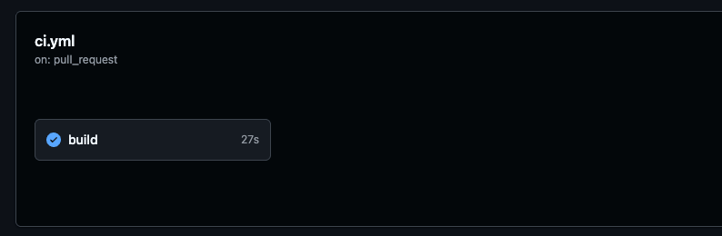

# API de Usuarios

Este proyecto consiste en una API desarrollada en Java que permite obtener una lista de usuarios. Se encuentra integrada con un flujo de integración continua utilizando GitHub Actions.

---

## 📄 Funcionalidad

La API expone endpoints para consultar usuarios.
Actualmente permite:

* Obtener la lista de usuarios

---

## 👥 Integrantes

* Maximiliano Bozzalla
* Axel Areco

---

## 💻 Lenguaje y tecnologías

* Java 21
* Maven
* JUnit / Mockito (testing)
* GitHub Actions (CI)

---

## ⚙️ Explicación del workflow

El proyecto utiliza un workflow de integración continua mediante GitHub Actions.

El flujo se ejecuta automáticamente cuando:

* Se realiza un `push` a las ramas `main`, `dev.guille` o `dev-maxi`
* Se abre un `pull request` hacia la rama `main`

Durante la ejecución:

1. Se clona el repositorio
2. Se configura el entorno con Java 21
3. Se ejecuta el comando:

```
mvn clean verify
```

Este proceso permite:

* Compilar el proyecto
* Ejecutar los tests automatizados
* Validar que el código no tenga errores

Si algún paso falla, el workflow se detiene y el build se marca como fallido.

---

## 📸 Estado del build

### Build exitoso


---

## 🚀 Cómo ejecutar el proyecto

### 1. Clonar el repositorio

```
git clone https://github.com/tu-usuario/tu-repo.git
cd tu-repo
```

### 2. Ejecutar la aplicación

```
mvn spring-boot:run
```

O bien:

```
mvn clean install
java -jar target/*.jar
```

---

## 🔗 Endpoint
* Obtener usuarios:

```
GET /usuarios
```

Respuesta esperada:

```json
[
  {
    "id": 1,
    "nombre": "Juan Perez",
    "email": "juan@example.com"
  }
]
```

---

## 📌 Notas

* Asegurarse de tener Java 21 instalado
* Maven configurado correctamente
* El puerto por defecto es el `8080`

---
